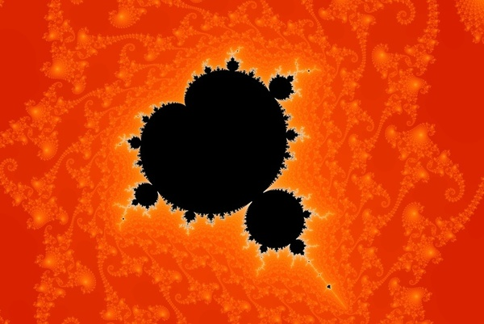
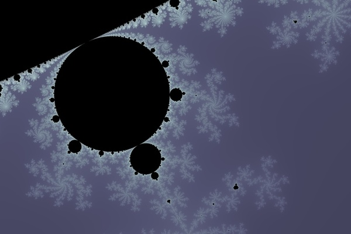

# Mandelbrot Set

*-0.748742+0.065078j, 0.00002*


*-0.74478548+0.11246286j, 0.00000203*


*0.13972-0.61771j, 0.034*

draw mandelbrot set with python matplotlib, and use numba to accelerate calculation. check 
[here](https://www.ibm.com/developerworks/community/blogs/jfp/entry/How_To_Compute_Mandelbrodt_Set_Quickly?lang=en_us) and [here](https://www.ibm.com/developerworks/community/blogs/jfp/entry/My_Christmas_Gift?lang=en) for how to calculate mandlebrot set

# How to use
```
# run python script and view the image
python mandelbrot.py

# run python script and save to file
python mandelbrot.py -s <outfile.jpg>
# and can furthur compess by following, keep width 800 pixel
convert <outfile.jpg> -resize '800' <outfile.jpg>
```